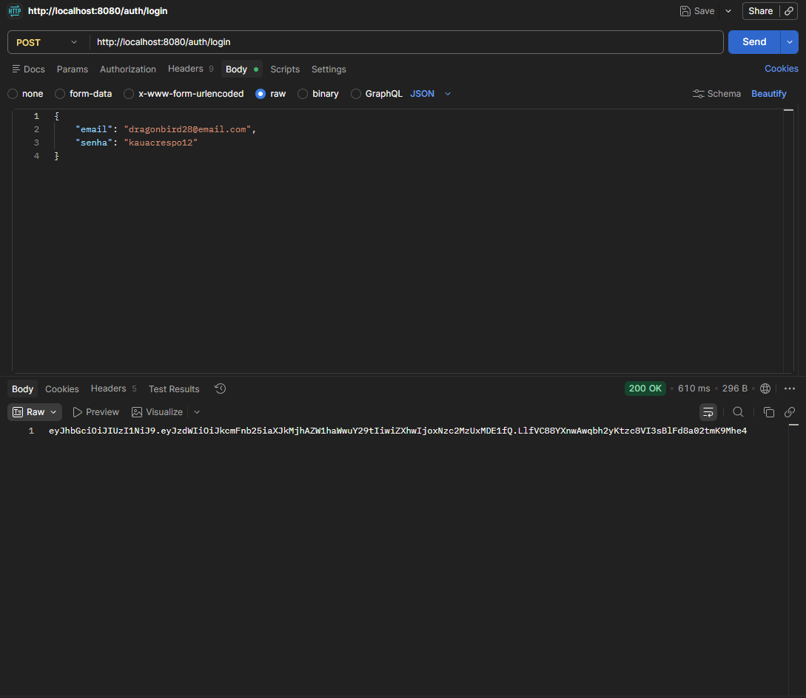
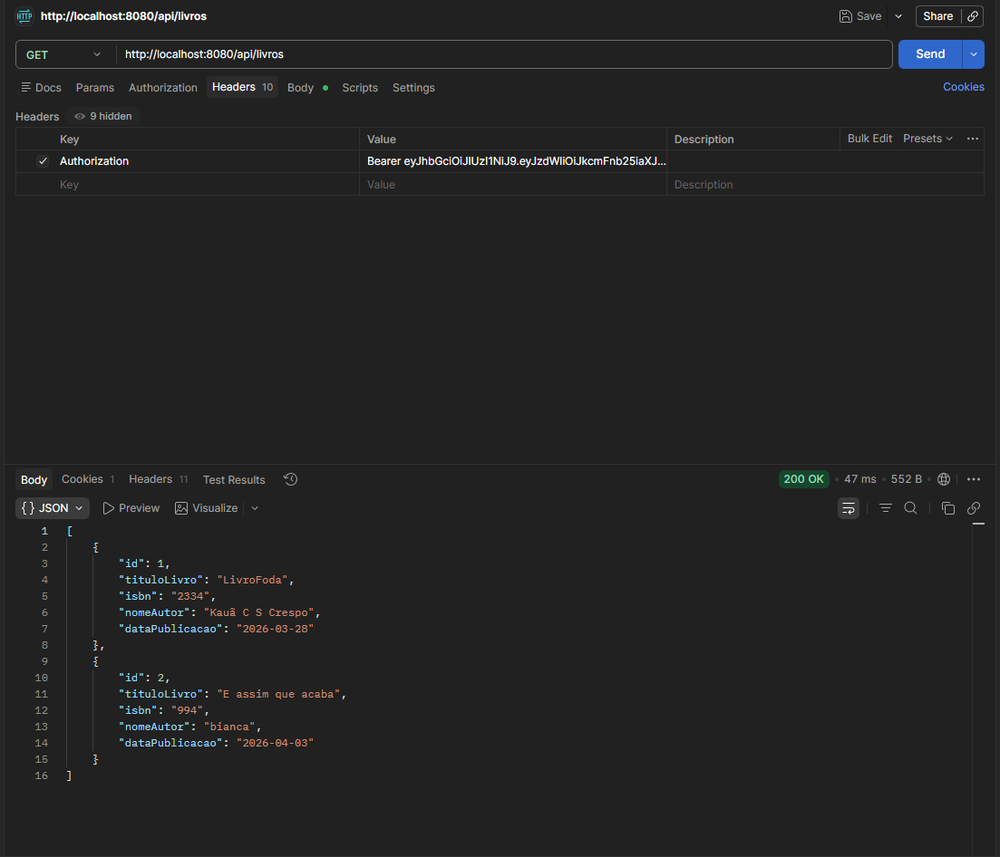

# 📚 Spring Boot JWT Books API

API REST desenvolvida com Spring Boot que utiliza autenticação JWT, documentação com Swagger e conta com testes unitários.

---

## 🚀 Tecnologias utilizadas

- Java
- Spring Boot
- Spring Security
- JWT
- JPA / Hibernate
- MySQL
- Swagger
- Lombok

---

## 🔐 Autenticação

A API utiliza autenticação baseada em JWT:

1. O usuário se registra em `/auth/register`
2. Realiza login em `/auth/login`
3. Recebe um token JWT
4. Envia o token no header:

---

## 📡 Endpoints

### 🔓 Públicos
- POST /auth/register
- POST /auth/login

### 🔒 Protegidos

#### 📚 Livros
- GET /livros
- POST /livros

#### ✍️ Autores
- GET /autores
- POST /autores

---

## 🧪 Testando com Postman

1. Faça login
2. Copie o token retornado
3. Adicione no header:

---
## 📸 Demonstração da API

### 🔐 Login / Token gerado


### 📚 Acesso aos livros


---

## 🧪 Testes

- Testes de controller com MockMvc
- Simulação de autenticação JWT
- Testes de fluxo de login e registro

---

## ▶️ Como rodar o projeto

```bash
git clone https://github.com/seuusuario/seuprojeto
cd seuprojeto
mvn spring-boot:run

